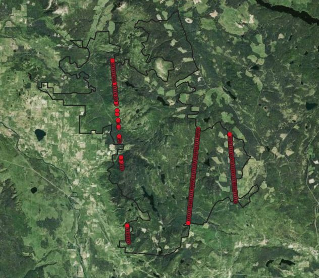

```{r setup, include=FALSE}
knitr::opts_chunk$set(echo = TRUE, 
                      warning = FALSE,
                      message = FALSE)

```

Within the Deception study site, we can compare the TRIM, eDTM, isat points along with lidar data. 
 

```{r load data, echo = FALSE }
# Read in geometic data set (independent of data assembly process) and compare to 
# ensemble dtm, lidar, trim. 

library(raster)
library(sf)
library(bcdata)
library(bcmaps)
library(dplyr)
library(rvest)
library(ggplot2)
library(tidyr)


## Load in eDTM layer and trim (from sync location)

data.dir <- "D:/Hengle_BCDEM30"
sync.dir <- "C:/Sync/BC_DEM"
temp.dir <- file.path(data.dir,"temp")
liDAR.dir <- 
"D:\\PEM_DATA\\BEC_DevExchange_Work\\Deception_AOI\\1_map_inputs\\covariates"

aoi <- st_read(file.path(
"D:\\PEM_DATA\\BEC_DevExchange_Work\\Deception_AOI\\0_raw_inputs\\base_layers\\aoi.gpkg"), quiet = TRUE)


#BC Albers proj4 string
bcalb = '+proj=aea +lat_1=50 +lat_2=58.5 +lat_0=45 +lon_0=-126 +x_0=1000000 +y_0=0 +ellps=GRS80 +towgs84=0,0,0,0,0,0,0 +units=m +no_defs +datum=NAD83'


if(file.exists(file.path(temp.dir, "deception_dem_pt.gpkg"))){
  #print("loading file")
  geopt <- st_read(file.path(temp.dir, "deception_dem_pt.gpkg"), quiet = TRUE)

} else {

# load in provinical DEMs
# 1) edtm: 
edtm <- raster(file.path(data.dir, "BC30m","dtm_elev.lowestmode_gedi.eml_m_30m_0..0cm_2000..2018_bc.epsg3005_v0.1.tif"))

#2 - TRIM: 
trim <- raster(file.path(data.dir, "trim", "TRIM","bc_elevation_25m_bcalb.tif"))

#3 - LiDAR 
l2_5 <- raster(file.path(liDAR.dir, "2.5m", "dem.tif"))
l5 <- raster(file.path(liDAR.dir, "5m", "dem.tif"))
l10 <- raster(file.path(liDAR.dir, "10m", "dem.tif"))
l25 <- raster(file.path(liDAR.dir, "25m", "dem.tif"))

# load in the isat2 points 
isat <- st_read(file.path(temp.dir, "isat2_deception.gpkg"), quiet = TRUE)

isat1 <- isat[1:112,] # south to north - westly transect 
isat2 <- isat[113:211,] # south to north - easterly transect
isat3 <- isat[212:349,] # north to south - middle transect

geopt <- isat %>%
  mutate(edtm = raster::extract(edtm, isat)) %>%
  mutate(trim = raster::extract(trim, isat)) %>%
  mutate(l2_5 = raster::extract(l2_5, isat)) %>%
  mutate(l5 = raster::extract(l5, isat)) %>%
  mutate(l10 = raster::extract(l10, isat)) %>%
  mutate(l25 = raster::extract(l25, isat)) 
  
geopt <- geopt %>%
  mutate(rn = row_number()) %>%
  mutate(trans = case_when(
    rn < 113 ~ "1", 
    rn >= 113 & rn <212 ~ "2",
    rn > 211 ~ "3"
  )) 


st_write(geopt, file.path(temp.dir, "deception_dem_pt.gpkg"))

} 

## add tiled data - found no difference between pts

# edtm_tile <- raster(file.path(data.dir, "BC30m", "tt30_tiles","T1265", "T1265", "dtm_M_T1265.tif"))
# 
# geopt <- geopt %>%
#   mutate(edtm_tile = raster::extract(edtm_tile, geopt)) 
# 
# unique(geopt$edtm_tile -geopt$edtm ) 


```

## Cross Section comparisons

The isat point data crossed within the deception boundary for 3 passes. Split into transects 1, 2, 3. Transect 2 and 3 represented evenly spaced points, while isat transect 1 had gaps.  

{width=50%}

```{r, echo = FALSE}

# # transect 2
# ggplot(geopt) + 
#   geom_point(aes(x = rn, y = edtm, colour = "red")) + 
#   geom_point(aes(x = rn, y = h_te_mean, colour = "green")) + 
#   geom_point(aes(x = rn, y = trim, colour = "blue")) + 
#   geom_line(aes(x = rn, y = edtm, colour = "red")) + 
#   geom_line(aes(x = rn, y = trim, colour = "blue")) + 
#   facet_wrap(~trans, scales = "free_x") 
# 

```

#### Compare between the data sources (trim, eDTM, isat, lidar (2.5 - 25m))

Firstly compare the eDTM, trim and isat points for the two consistent transects (2 - easterly edge) and 3 (middle transect).

```{r , echo = FALSE}
geopt <- geopt %>% filter(trans %in% c("2","3"))

geolong <- geopt %>%
  pivot_longer(cols = c(edtm, trim,l2_5 ,l5,l10,l25,h_te_mean), names_to = "dem_type", values_to = "value") %>%
  mutate(dem_type = ifelse(dem_type == "h_te_mean", "isat", dem_type))

geolong2 <- geolong %>%
  filter(dem_type %in% c("edtm", "trim", "isat"))

geolong22 <- geolong2 %>% filter(trans =="2")
geolong23 <- geolong2 %>% filter(trans =="3")

ggplot(geolong22, aes(x = rn, y = value)) + 
         geom_point(aes(colour = dem_type)) + 
  geom_line(aes(colour = dem_type)) + 
 facet_grid(~trans, scales = "free_x" )

ggplot(geolong23, aes(x = rn, y = value)) + 
         geom_point(aes(colour = dem_type)) + 
  geom_line(aes(colour = dem_type)) + 
 facet_grid(~trans, scales = "free_x" )

```

- Trim is consistently higher elevation than eDTM or isat points. 
- complex relief (ie transect 3 - 275m to 300m has more variation in patterns)

### Compare lidar to eDTM and TRIM datasets. 

Compare the 25m lidar upscaled values to eDTM and TRIM. Tested variation in lidar reolution (2.5, 5, 10,25 and showed little difference in values )

```{r, echo = FALSE}
geolong3 <- geolong %>%
  filter(dem_type %in% c("edtm", "trim", "l25"))

geolong22 <- geolong3 %>% filter(trans =="2")
geolong23 <- geolong3 %>% filter(trans =="3")

ggplot(geolong22, aes(x = rn, y = value)) + 
         geom_point(aes(colour = dem_type)) + 
  geom_line(aes(colour = dem_type))

ggplot(geolong23, aes(x = rn, y = value)) + 
         geom_point(aes(colour = dem_type)) + 
  geom_line(aes(colour = dem_type)) 

```


# Deception AOI extent.  

```{r, eval = FALSE, echo = FALSE}

#BC Albers proj4 string
bcalb = '+proj=aea +lat_1=50 +lat_2=58.5 +lat_0=45 +lon_0=-126 +x_0=1000000 +y_0=0 +ellps=GRS80 +towgs84=0,0,0,0,0,0,0 +units=m +no_defs +datum=NAD83'

# read in the datasets
l25 <- raster(file.path(liDAR.dir, "25m", "dem.tif"))

#2 - TRIM: 
trim <- raster(file.path(data.dir, "trim", "TRIM","bc_elevation_25m_bcalb.tif"))

# mosic the tiles for Deception together
 t1 <- raster(file.path(data.dir, "BC30m", "tt30_tiles","T1265", "T1265", "dtm_M_T1265.tif"))
 t2 <- raster(file.path(data.dir, "BC30m", "tt30_tiles","T1264", "T1264", "dtm_M_T1264.tif"))
 t3 <- raster(file.path(data.dir, "BC30m", "tt30_tiles","T1318", "T1318", "dtm_M_T1318.tif"))
 t4 <- raster(file.path(data.dir, "BC30m", "tt30_tiles","T1319", "T1319", "dtm_M_T1319.tif"))
 
edtm30 <- mosaic(t1, t2, t3, t4, fun = mean)


##crop the trim to AOI (lidar extent)
l25_dec <- crop(l25, aoi)
trim_dec <- crop(trim, aoi)
edtm30_dec <- crop(edtm30, aoi)

extent(edtm30_dec)
extent(l25_dec)
extent(trim_dec)

edtm30_dec_rs <- resample(edtm30_dec, l25_dec, "bilinear")
trim_dec_rs <- resample(trim_dec, l25_dec, "bilinear" )

edtm30_dec_rs <- crop(edtm30_dec_rs, l25_dec)
trim_dec_rs <- crop(trim_dec_rs, l25_dec)


dems <- stack(edtm30_dec_rs, trim_dec_rs, l25_dec)


# writeRaster(dems, temp.dir, "dems.tif")
# 
# writeRaster(l25_dec , file.path(temp.dir,'lidar_dec_stack.tif'), overwrite = TRUE)
# writeRaster(edtm30_dec_rs , file.path(temp.dir,'edtm_dec_stack.tif'), overwrite = TRUE)
# writeRaster( trim_dec_rs, file.path(temp.dir,'trim_dec_stack.tif'), overwrite = TRUE)


delta_lidar <- dems$dem - dems$layer
delta_trim <- dems$dem - dems$bc_elevation_25m_bcalb

writeRaster(delta_lidar , file.path(temp.dir,'lidar_edtm_diff.tif'), overwrite = TRUE)
writeRaster(delta_trim , file.path(temp.dir,'lidar_trim_diff.tif'), overwrite = TRUE)

# 
# sf::gdal_utils(
#   util = "warp", 
#   source = file.path(temp.dir,'edtm_dec.tif'), 
#   destination = file.path(temp.dir,"edtm_dec_3005.tif"), 
#   options = c("-t_srs", "EPSG:3005",
#               "-r", "cubic"))


```

I calculated the difference from lidar to the eDTM and TRIM data sets with Deception study area. Note for this to occur some reprojection was necesary to line up lidar, eDTM and TRIM datasets.  

The eDTM delta values ranged from (-9 to 47.4 ) indicating the underprediction of eDTM in general. The delta or lidar - trim = (-24 to 34) indicating more spread in uncertainty by underestimate and over estimate of values. 

{width=45%}
{width=45%}

 
 
### Cutblocks
 
 Zooming in on an areas of interest to assess the impact of cutblocks 
 
{width=50%}

{width=50%}

{width=50%}


## Areas of steep terrain. 


{width=50%}

{width=50%}


{width=50%}

Interestingly in some areas where TRIM showed larger error (ie. - 25m) the eDTM was more accuracy. 

{width=50%}

{width=50%}


### Overall thoughts 

- TRIM estimates showed larger proportion of data with -5m to +5m than eDTM. 
- eDTM showed bias to under estimate of elevation.
- eDTM sensitive to cutblocks 
- both TRIM and EDTM showed higher error in areas with high hillshade. 
- eDTM outperformed TRIM in some areas. 
